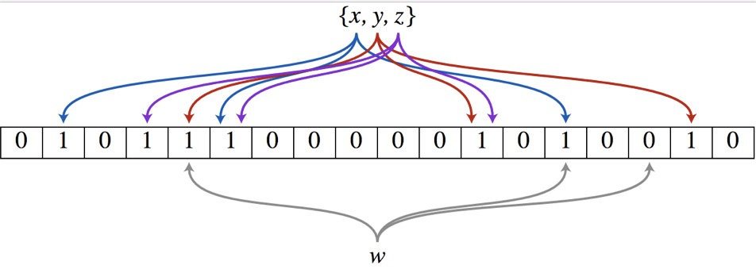

<!-- TOC -->

- [redis 原理及安装](#redis-原理及安装)
  - [nosql](#nosql)
    - [架构的发展历程](#架构的发展历程)
    - [nosql的优势](#nosql的优势)
    - [特点](#特点)
    - [分类](#分类)
    - [分布式数据库中的CAP原理](#分布式数据库中的cap原理)
  - [redis](#redis)
    - [概述](#概述)
    - [三个特点](#三个特点)
    - [用途](#用途)
    - [基础知识](#基础知识)
  - [docker安装redis](#docker安装redis)
    - [redis.conf下载](#redisconf下载)
    - [docker镜像拉取运行容器](#docker镜像拉取运行容器)
- [redis 数据类型](#redis-数据类型)
  - [五大数据类型](#五大数据类型)
    - [String 字符串](#string-字符串)
    - [Hash 哈希](#hash-哈希)
    - [List 列表](#list-列表)
    - [Set 集合](#set-集合)
    - [Zset(sorted set) 有序集合](#zsetsorted-set-有序集合)
  - [操作指令](#操作指令)
    - [keys 指令](#keys-指令)
    - [String 指令](#string-指令)
    - [List 指令](#list-指令)
    - [Set 指令](#set-指令)
    - [Zset 指令](#zset-指令)
    - [Hash 指令](#hash-指令)
- [redis 配置文件](#redis-配置文件)
  - [单位 UNITS](#单位-units)
  - [引入 INCLUDES](#引入-includes)
  - [通用配置 GENERAL](#通用配置-general)
    - [daemonize 守护进程](#daemonize-守护进程)
    - [pidfile 进程管道id文件](#pidfile-进程管道id文件)
    - [port 端口](#port-端口)
    - [databases 数据库数量](#databases-数据库数量)
    - [tcp-backlog 511 连接队列](#tcp-backlog-511-连接队列)
  - [网络配置 NETWORK](#网络配置-network)
    - [bind 端口绑定](#bind-端口绑定)
    - [timeout 过期时间](#timeout-过期时间)
    - [keepalive](#keepalive)
  - [日志 LOGS](#日志-logs)
    - [loglevel 日志级别](#loglevel-日志级别)
    - [logfile 日志路径](#logfile-日志路径)
    - [Syslog-enabled 是否输出系统日志](#syslog-enabled-是否输出系统日志)
    - [Syslog-ident 指定日志标识](#syslog-ident-指定日志标识)
    - [Syslog-facility 指定syslog设备](#syslog-facility-指定syslog设备)
  - [安全配置 SECURITY](#安全配置-security)
    - [`config set requirepass 'password'` 设置密码](#config-set-requirepass-password-设置密码)
    - [`auth password` 使用前验证密码](#auth-password-使用前验证密码)
  - [限制 LIMIT](#限制-limit)
    - [Maxclients 同一时间最大客户端连接数](#maxclients-同一时间最大客户端连接数)
    - [Maxmemory 最大内存限制](#maxmemory-最大内存限制)
    - [Maxmemory-policy 缓存过期清洁策略](#maxmemory-policy-缓存过期清洁策略)
    - [Maxmemory-samples 设置样本数](#maxmemory-samples-设置样本数)
  - [SNAPSHOT 快照](#snapshot-快照)
    - [save \<seconds> \<times> 快照策略](#save-seconds-times-快照策略)
    - [Stop-writes-on-bgsave-error 出错即停策略](#stop-writes-on-bgsave-error-出错即停策略)
    - [rdbcompression 压缩](#rdbcompression-压缩)
    - [rdbchecksum 校验](#rdbchecksum-校验)
    - [dbfilename 本地数据库文件名](#dbfilename-本地数据库文件名)
    - [dir 指定本地数据库存放目录](#dir-指定本地数据库存放目录)
  - [APPEND ONLY 仅追加](#append-only-仅追加)
    - [appendonly 开启aof](#appendonly-开启aof)
    - [appendfilename aof文件名](#appendfilename-aof文件名)
    - [appendfsync aof持久化策略](#appendfsync-aof持久化策略)
    - [no-appendfsync-on-rewrite 重写时是否运用appendfsync](#no-appendfsync-on-rewrite-重写时是否运用appendfsync)
    - [auto-aof-rewrite-percentage aof文件增长比例](#auto-aof-rewrite-percentage-aof文件增长比例)
    - [auto-aof-rewrite-min-size aof文件重写最小的文件大小](#auto-aof-rewrite-min-size-aof文件重写最小的文件大小)
- [redis 持久化](#redis-持久化)
  - [RDB（Redis Database）](#rdbredis-database)
    - [fork](#fork)
    - [快照 dump.rdb](#快照-dumprdb)
    - [数据恢复](#数据恢复)
    - [优势](#优势)
    - [劣势](#劣势)
  - [AOF（append only file）](#aofappend-only-file)
    - [仅追加 appendonly.aof](#仅追加-appendonlyaof)
    - [rewrite](#rewrite)
    - [优势](#优势-1)
    - [劣势](#劣势-1)
  - [二者关系](#二者关系)
    - [同时使用](#同时使用)
    - [特点](#特点-1)
- [redis 事务](#redis-事务)
  - [命令](#命令)
    - [基本指令](#基本指令)
    - [部分支持事务(不保证原子性)](#部分支持事务不保证原子性)
  - [watch监控](#watch监控)
    - [悲观锁、乐观锁、CAS](#悲观锁乐观锁cas)
    - [watch](#watch)
  - [三阶段、三特性](#三阶段三特性)
    - [三阶段](#三阶段)
    - [三特性](#三特性)
- [redis 消息订阅发布](#redis-消息订阅发布)
  - [命令](#命令-1)
- [redis 主从复制](#redis-主从复制)
  - [复制原理](#复制原理)
  - [配置](#配置)
    - [指令配置](#指令配置)
    - [配置文件](#配置文件)
    - [docker redis主从配置](#docker-redis主从配置)
  - [故障](#故障)
    - [主机故障](#主机故障)
    - [从机故障](#从机故障)
  - [常用策略](#常用策略)
    - [一主多从](#一主多从)
    - [层级传递(树状)](#层级传递树状)
    - [主从倒置](#主从倒置)
    - [哨兵模式](#哨兵模式)
  - [缺陷](#缺陷)
  - [redis 缓存实际问题](#redis-缓存实际问题)
    - [缓存穿透](#缓存穿透)
    - [缓存击穿](#缓存击穿)
    - [缓存雪崩](#缓存雪崩)

<!-- /TOC -->

# redis 原理及安装

## nosql

### 架构的发展历程

- 单机mysql<br>
    - 瓶颈：<br>
        数据量过大，索引内存无法支撑，访问量（读写混合）一台机器无法支撑

- memcached + mysql + 垂直拆分<br>
    - memcached：<br>
        在应用程序的数据交互层与数据库之间添加一层缓存层，最初的方案是使用文件缓存，但是文件缓存最初存在多台机器间`不能共享`的问题，大量的小文件缓存也`增加了服务器的io压力`，后使用`memcached`代替
    
    - 垂直拆分:<br>
        单纯的增加数据库实例数量

- MySQL主从读写分离
    - 主从复制<br>
    - 读写分离<br>
        写操作放在主库，读操作放在从库
    - 瓶颈:<br>
        mysql主库写压力开始出现瓶颈，同时`myisam`引擎的`表锁`，导致高并发场景的压力

- 水平分库 + 水平分表 + mysql集群<br>
    - 分库:<br>
        将数据根据类型(频繁变更的数据和不太会变更的冷数据或是同一类型需要关联查询的数据)分别存放在不同的库中
    - 水平分表:<br>
        将大表的数据进行水平拆分，放在多个表中
    - mysql集群<br>
    - 瓶颈:<br>
        `MySQL拓展性`出现瓶颈

- 分布式集群 

### nosql的优势

> `nosql` ( not only sql ) 非关系型数据库

- 易扩展<br>
    去掉了关系型数据库的关系型特点，因为本质就是`kv键值对`，`没有数据类型，字段`的约束

- 大数据量高性能<br>
    源于nosql的`无关系性，结构简单`<br>
    MySQL使用的query cache，每次表更新时，cache失效<br>
    - mysql执行一条查询语句，会对该语句进行hash计算得到一个hash值，然后使用该hash值去一个hash链表中查找，如果匹配到了，再去cache中查找，如果没有找到，则将该hash值放入链表，同时将查询结果放入cache中

    而nosql使用`记录级cache`
    - 所谓记录级cache，则是缓存脱离了mysql层，单独设置了缓存层来独立进行缓存工作

- 数据模型灵活<br>
    无需事先创建字段，随时可以存储自定义的数据格式

- cap


### 特点

> `kv`（键值对） + `cache`（缓存） + `persistence`（持久化）

### 分类

- kv键值对

- 文档型数据库

- 列存储数据库

- 图形数据库

### 分布式数据库中的CAP原理

- 分布式和集群
  
    - 分布式：<br>
        不同的多台服务器上面`部署不同的服务模块`，对外提供服务和组内协调

    - 集群:<br>
        不同的多台服务器上`部署相同的服务模块`，通过分布式调度软件进行统一的调度，对外提供服务和访问

- 传统的ACID
  - `A (Atomicity)` 原子性<br>
    一个事务中的多个数据操作构成一个不可分割的原子单元，所有操作都成功才提交整个事务

  - `C (Consistency)` 一致性<br>
    事务的运行不会改变数据原本的一致性约束，数据库所处的状态和他的业务规则一致，即数据不会被破坏。a转账给b，无论成功与否总金额不会改变

  - `I (Isolation)` 独立性<br>
    事务之间不会相互影响，一个事务要访问的数据正在被另一个事务修改，只要该事务没有提交，那个访问的数据仍旧是原始状态

  - `D (Durability)` 持久性<br>
    持久性就是事务一旦提交，数据就会永久保存在硬盘上


- CAP

    - `C (Consistency) ` 强一致性<br>
        >数据在多个副本之间能够保持一致的特性，比如redis的主从结构<br>

        假设一台服务因为网络故障无法实现写操作，此时就会强制所有的服务都不写入，也就是说在保证分区容错性的情况下，强一致性和可用性只能二选一
    - `A (Availability)` 可用性<br>
        >系统需要一直处于可用状态下，能够正常响应数据，但是不保证数据是最新数据<br>

        读写操作在单台服务器出故障后(该服务器可能无法读写了)，在其他服务器上仍然能够继续完成读写操作
    - `P (Partition tolerance)` 分区容错性<br>
        分布式系统在遇到网络故障，仍然能够对外提供满足一致性和可用性的服务，除非整个网络故障

- CAP 抉择

    > CAP 指在分布式存储系统中，最多只能满足其中两个<br>

    > 一个分布式系统，P 是大前提，两个不同的分区可能存在网络故障，导致分区间不能互相访问，因此`分区容错性无可避免`，即P总是成立的

    > 在这个基础上，`C` 和 `A` 只能二选其一<br>
    如果我们要强制保持一致性，那么在分区一执行写操作时，必须锁定其他分区的读写操作，只有数据同步之后，才能重新开放读写。那么锁定期间，这些其他分区是没有可用性而言的<br>
    如果保证可用性，那么便不能锁定分区，一致性就不能保证了

    - CA : 单点集群，满足一致性和可用性，传统的关系型数据库

        > 这种情况就代表数据库只有一个主库，不存在从库，即该系统就`不是一个分布式系统`

    - AP : 满足可用性和分区容忍性，对一致性要求低

        > 主从的实现方式，牺牲数据的一致性，而`保证数据的最终一致性`

    - CP : 满足一致性和分区容忍性，通常性能不是太高

        > 就分布式系统而言，这种并不实用

    - 一致性和可用性的抉择
      - 一致性需求<br>
        很多应用场景不要求严格的数据库事务，对读一致性或者写一致性要求并不高。目的在于实现最终的一致性(点赞数等)
      - 实时性需求<br>
        就关系型数据库而言，插入后立刻能够查询到，有些应用场景并不需要这么高的实时性，在一定时间后订阅者才能看到这条数据也是可以接受的(微博等)
      - 多表关联需求<br>
        大数据量的web系统，对多个大表的关联查询较为忌讳，利用nosql对关联数据进行缓存，更多只进行主表的主键查询以及分页查询

- BASE

    - `BA (Basically Available)` 基本可用
    - `S (Soft state)` 软状态
    - `E (Eventually consistent)` 最终一致<br>

    >思想就是通过让系统放松对某一时刻数据一致性的要求换取系统整体伸缩性和性能上的改观

## redis

### 概述

> 高性能的(key/value)分布式内存数据库，基于内存运行并支持持久化的nosql数据库

### 三个特点

- 支持持久化
- 支持 kv，list，set，zset，hash 等数据类型结构   
- 支持数据备份，即 master-slave 模式的数据备份

### 用途

- 内存存储和持久化，`异步` 将内存数据存储于硬盘上，不影响继续服务
- 有取最新n条数据的操作
- 模拟类似于HttpSession这种需要设定过期时间的功能
- 发布订阅消息系统
- 定时器、计数器

### 基础知识

- 单进程
- 默认16个库 索引从0开始
    ``` sql
    select 8 #切换到第7个库(角标从0开始)
    ```
- `DBSIZE` 查看 keys 的数量
- `keys *` 查看所有的 key 详细信息
    ``` sql
    # 支持多字符匹配查找
    127.0.0.1:6379> keys k?
    (empty array)
    127.0.0.1:6379> keys k???
    "key1"
    127.0.0.1:6379> keys key?
    "key1"
    127.0.0.1:6379> keys k*
    "key1" 
    ```
- `FLUSHDB` 清除当前库
- `FLUSHALL` 清除所有库
    > flushall 是一种写操作，所以在aof做持久化时也会记录<br>
    > flushall 会立刻将内存的内容写入硬盘，使用rdb进行持久化时，执行flushall会先立刻清空数据，然后再写入硬盘，所以dump.rdb会是一个空值<br>
    > `谨慎使用flushall`
- 16个库统一密码
- 默认端口6379

## docker安装redis

### redis.conf下载

[redis中文站](http://www.redis.cn/download.html)

### docker镜像拉取运行容器

``` docker
# 拉取镜像
docker pull redis 
```

``` docker
# 运行容器
docker run -p 6378:6379 --name redis01 -v /vagrant_data/redis/redis01/conf/redis.conf:/etc/redis/redis.conf -v /vagrant_data/redis/redis01/data:/data -d redis redis-server /etc/redis/redis.conf --appendonly yes
```
> `redis-server /etc/redis/redis.conf` 设置以指定文件为配置文件启动<br>
> `--appendonly yes` 开启redis持久化
<br>

# redis 数据类型

## 五大数据类型

### String 字符串
> 一个key 对应一个 value<br>
> string是 `二进制安全的`，支持jpg图片和序列化的对象<br>
> 一个redis字符串最大可以512M

### Hash 哈希
> string类型的 `field和value的映射表`，适合用于存储对象

### List 列表
> list 是简单的字符串列表，按照插入顺序排序，可以在头尾添加数据<br>
> `底层是一个链表`<br>
> 因此头尾插入性能较好，中间进行操作性能较差

### Set 集合
> string类型的`无序不重复`数据的集合<br>
> `通过hashtable实现`

### Zset(sorted set) 有序集合
> 也是string类型的`不重复`数据的集合<br>
> `不同的是每一个元素都会关联一个double类型的分数`<br>
> redis通过分数来为集合中的成员从小到大进行排序，成员是唯一的，但`分数可以重复`

## 操作指令

[参考指令](http://redisdoc.com/)

### keys 指令

- `keys *` 查看所有keys
- `exists key名字` 查看当前库某个key是否存在

    >存在返回1，没有返回0
- `move key db` 移动某个key到别的库
- `expire key 秒` 为给定key设置过期时间
  
    >过期的数据会直接移除，所以可以当作删除命令使用
- `ttl key` 查看还有多少秒过期， -1 永不过期，-2 已过期
- `type key` 查看key的类型

### String 指令

- `set/get/del/append/strlen key` 设置/获取/删除/追加/获取长度
  
    > 使用set去设置一个已经存在的key的时候，会覆盖原数据，append则是在原数据后追加<br>
    ``` bash
    127.0.0.1:6379> set k1 aa
    OK
    127.0.0.1:6379> append k1 123
    (integer) 5
    127.0.0.1:6379> get k1
    "aa123"
    ```
- `incr/decr/incrby/decrby key [num]` 加1/减1/加指定数/减指定数
    ``` bash
    127.0.0.1:6379> get n1
    "2"
    127.0.0.1:6379> incr n1
    (integer) 3
    127.0.0.1:6379> incrby n1 2
    (integer) 5
    ```

- `getrange/setrange` 获取指定位置的值/修改字符串指定位置的值
    ``` bash
    127.0.0.1:6379> set s1 abcdefg
    OK
    127.0.0.1:6379> getrange s1 1 3 #获取下标1到3的值
    "bcd"
    127.0.0.1:6379> setrange s1 2 123 #从下标2开始后面三位设置成123
    (integer) 7
    127.0.0.1:6379> get s1
    "ab123fg"
    ```

- `setex key 秒 value` 创建键值对的同时，设置过期时间
    ``` bash
    127.0.0.1:6379> setex t1 10 abc
    OK
    127.0.0.1:6379> ttl t1
    (integer) 5
    127.0.0.1:6379> get t1
    "abc"
    127.0.0.1:6379> ttl t1
    (integer) -2
    127.0.0.1:6379> get t1
    (nil)
    ```

- `setnx key value` 不存在该key时创建

- `mset/mget/msetnx` 批量创建/批量获取/批量不存在时创建
    ``` bash
    127.0.0.1:6379> mset k1 v1 k2 v2 k3 v3
    OK
    127.0.0.1:6379> mget k1 k2 k3
    1) "v1"
    2) "v2"
    3) "v3"
    ```
    > 如果要创建的key 部分存在部分不存在，就都不会成功，redis的操作具有原子性
    ``` bash
    127.0.0.1:6379> msetnx k3 v3 k4 v4
    (integer) 0
    127.0.0.1:6379> mget k3 k4
    1) "v3"
    2) (nil)
    127.0.0.1:6379> msetnx k4 v4 k5 v5
    (integer) 1
    127.0.0.1:6379> mget k4 k5
    1) "v4"
    2) "v5"
    ```

### List 指令

- `lpush/rpush/lrange` 左进list/右进list/查询list中指定范围的数据

    可以理解为取就是从左取，<br>
    因此`左进左出就是栈，先进后出`<br>
    `右进左出就是队列，先进先出`
    ``` bash
    127.0.0.1:6379> lpush list1 1 2 3 4 5
    (integer) 5
    127.0.0.1:6379> lrange list1 0 -1
    1) "5"
    2) "4"
    3) "3"
    4) "2"
    5) "1"
    127.0.0.1:6379> rpush list2 1 2 3 4 5
    (integer) 5
    127.0.0.1:6379> lrange list2 0 -1
    1) "1"
    2) "2"
    3) "3"
    4) "4"
    5) "5"
    ```
    > lrange的两个参数，分别指取出范围的两个下标，`也可以用负数下标`，-1指最后一个元素，-2指倒数第二个元素

- `lpop/rpop` 左出栈/右出栈

    ```bash
    127.0.0.1:6379> lpop list1
    "5"
    127.0.0.1:6379> rpop list2
    "5"
    ```

- `lindex` 按照索引下标获得元素(下标从左至右排列)

    ``` bash
    127.0.0.1:6379> lrange list1 0 -1
    1) "4"
    2) "3"
    3) "2"
    4) "1"
    127.0.0.1:6379> lindex list1 0
    "4"
    ```

- `llen` 获取list长度

    ``` bash
    127.0.0.1:6379> llen list1
    (integer) 4
    ```

- `lrem` 删除n个指定value

    ``` bash
    127.0.0.1:6379> rpush list3 jack jack jack tom tom tom lily lily lily
    (integer) 9
    127.0.0.1:6379>
    127.0.0.1:6379>
    127.0.0.1:6379> LRANGE list3 0 -1
    1) "jack"
    2) "jack"
    3) "jack"
    4) "tom"
    5) "tom"
    6) "tom"
    7) "lily"
    8) "lily"
    9) "lily"
    127.0.0.1:6379> lrem list3 2 tom
    (integer) 2
    127.0.0.1:6379> LRANGE list3 0 -1
    1) "jack"
    2) "jack"
    3) "jack"
    4) "tom"
    5) "lily"
    6) "lily"
    7) "lily"
    ```

- `ltrim` 截取list指定范围的值，再重新赋值给list

    ``` bash
    127.0.0.1:6379> lrange list4 0 -1
    1) "a"
    2) "b"
    3) "c"
    4) "d"
    5) "e"
    6) "f"
    7) "g"
    127.0.0.1:6379> ltrim list4 3 5
    OK
    127.0.0.1:6379> lrange list4 0 -1
    1) "d"
    2) "e"
    3) "f"
    ```

- `rpoplpush 源list 目的list` 从源list右端取出一个元素放入目的list的最左端

    ``` bash
    127.0.0.1:6379> lrange list1 0 -1
    1) "4"
    2) "3"
    3) "2"
    4) "1"
    127.0.0.1:6379> lrange list2 0 -1
    1) "1"
    2) "2"
    3) "3"
    4) "4"
    127.0.0.1:6379> rpoplpush list1 list2
    "1"
    127.0.0.1:6379> lrange list1 0 -1 # 源list最右端被取出
    1) "4"
    2) "3"
    3) "2"
    127.0.0.1:6379> lrange list2 0 -1 # 目的list最左端放入
    1) "1"
    2) "1"
    3) "2"
    4) "3"
    5) "4"
    ```

- `lset key index value` 修改指定下标位置的元素为其他值
    ``` bash
    127.0.0.1:6379> lrange list4 0 -1
    1) "d"
    2) "e"
    3) "f"
    127.0.0.1:6379> lset list4 1 edit
    OK
    127.0.0.1:6379> lrange list4 0 -1
    1) "d"
    2) "edit"
    3) "f"
    ```

- `linsert key before/after 参照元素 插入的值` 在list中某元素前/后插入元素

    ``` bash
    127.0.0.1:6379> linsert list4 before edit before
    (integer) 4
    127.0.0.1:6379> linsert list4 after edit after
    (integer) 5
    127.0.0.1:6379> lrange list4 0 -1
    1) "d"
    2) "before"
    3) "edit"
    4) "after"
    5) "f"
    ```

### Set 指令

- `sadd/smembers/sismember` 创建集合或添加元素到集合/列出集合元素/判断某个元素是否在集合中

    > `set 是不重复的元素的无序集合`
    ``` bash
    127.0.0.1:6379> sadd s1 1 1 2 2 3 3
    (integer) 3
    127.0.0.1:6379> smembers s1
    1) "1"
    2) "2"
    3) "3"
    127.0.0.1:6379> sismember s1 1
    (integer) 1
    ```

- `scard key` 获取集合元素的个数

- `srem key value` 删除指定集合中的某个元素

- `srandmember key 整数` 从set中随机取出几个元素

    ``` bash
    127.0.0.1:6379> sadd s2 1 2 3 4 5 6 7 8 9
    (integer) 9
    127.0.0.1:6379> srandmember s2 3
    1) "4"
    2) "7"
    3) "5"
    127.0.0.1:6379> srandmember s2 3
    1) "2"
    2) "9"
    3) "5"
    ```

- `spop key [count]` 随机出栈n个元素
  
    ``` bash
    127.0.0.1:6379> spop s2
    "4"
    127.0.0.1:6379> spop s2
    "9"
    127.0.0.1:6379> spop s2
    "5"
    127.0.0.1:6379> smembers s2
    1) "1"
    2) "2"
    3) "3"
    4) "6"
    5) "7"
    6) "8"
    ```

- `smove key1 key2 key1里的某个值` 移动set1中的某个值到set2

    ``` bash
    127.0.0.1:6379> sadd s3 1 2 3
    (integer) 3
    127.0.0.1:6379> sadd s4 a b c
    (integer) 3
    127.0.0.1:6379> smove s3 s4 1
    (integer) 1
    127.0.0.1:6379> smembers s3
    1) "2"
    2) "3"
    127.0.0.1:6379> smembers s4
    1) "c"
    2) "b"
    3) "1"
    4) "a"
    127.0.0.1:6379>
    ```

- `sdiff/sinter/sunion key1 key2` 差集/交集/并集

    > 需要注意 sdiff 返回的是在 set1 里有在 set2 没有的值
    ``` bash
    127.0.0.1:6379> sadd s5 1 2 3
    (integer) 3
    127.0.0.1:6379> sadd s6 2 3 4
    (integer) 3
    127.0.0.1:6379> sdiff s5 s6
    1) "1"
    127.0.0.1:6379> sinter s5 s6
    1) "2"
    2) "3"
    127.0.0.1:6379> sunion s5 s6
    1) "1"
    2) "2"
    3) "3"
    4) "4"
    ```

### Zset 指令

> 就是在set的基础上添加了score

-  `zadd/zrange [withscores]/zrevrange` 创建、添加有序集合/获取集合中的值/逆序获取集合中的值

    >  `withscores` 参数会把分数一同输出<br>
    > score 可以重复，值不能重复
    ``` bash
    127.0.0.1:6379> zadd z1 98 lilei 80 jack 60 tom 60 wang
    (integer) 4
    127.0.0.1:6379> zrange z1 0 -1
    1) "tom"
    2) "wang"
    3) "jack"
    4) "lilei"
    127.0.0.1:6379> zrange z1 0 -1 withscores
    1) "tom"
    2) "60"
    3) "wang"
    4) "60"
    5) "jack"
    6) "80"
    7) "lilei"
    8) "98"
    127.0.0.1:6379> zrevrange z1 0 -1 withscores
    1) "lilei"
    2) "98"
    3) "jack"
    4) "80"
    5) "wang"
    6) "60"
    7) "tom"
    8) "60"
    ```

- `zrangebyscore score区间 [withscores] [limit offset count]/zrevrangebyscore` 获取某个分数范围的所有元素/逆序获取

    > `(score` 代表不包含该数值<br>
    > `withscores` 参数会把分数一同输出<br>
    > `limit offset count` 表示从下标 offset 开始截取 count 个<br>
    > `zrevrangebyscore` 的score区间起止位置是相反的
    ``` bash
    127.0.0.1:6379> zrangebyscore z1 60 90
    1) "tom"
    2) "wang"
    3) "jack"
    127.0.0.1:6379> zrangebyscore z1 60 90 withscores
    1) "tom"
    2) "60"
    3) "wang"
    4) "60"
    5) "jack"
    6) "80"
    127.0.0.1:6379> zrangebyscore z1 (60 90 withscores
    1) "jack"
    2) "80"
    127.0.0.1:6379> zrangebyscore z1 60 90 withscores limit 1 2
    1) "wang"
    2) "60"
    3) "jack"
    4) "80"
    127.0.0.1:6379> zrevrangebyscore z1 90 60
    1) "jack"
    2) "wang"
    ```

- `zrem` 删除某个元素
    ``` bash
    127.0.0.1:6379> zrem z1 tom
    (integer) 1
    127.0.0.1:6379> zrange z1 0 -1
    1) "wang"
    2) "jack"
    3) "lilei"
    ```

- `zcard/zcount key score区间` 获取集合元素个数/获取某个区间元素个数

    ``` bash
    127.0.0.1:6379> zcard z1
    (integer) 3
    127.0.0.1:6379> zcount z1 60 90
    (integer) 2
    127.0.0.1:6379> zcount z1 (60 90
    (integer) 1
    ```

- `zrank key values/zrevrank key values/zscore key values` 获取下标/逆序获取下标/获取分数
  
    ``` bash
    127.0.0.1:6379> zrank z1 jack
    (integer) 1
    127.0.0.1:6379> zscore z1 jack
    "80"
    ```


### Hash 指令

> kv模式不变，但是v是一个或多个键值对

- `hset/hget/hmset/hmget/hgetall/hdel` 创建/获取/创建多个/获取多个/获取全部/删除

    ``` bash
    127.0.0.1:6379> hset h1 name jack age 23 gender male
    (integer) 3
    127.0.0.1:6379> hget h1 name
    "jack"
    127.0.0.1:6379> hmget h1 name age gender
    1) "jack"
    2) "23"
    3) "male"
    127.0.0.1:6379> hgetall h1
    1) "name"
    2) "jack"
    3) "age"
    4) "23"
    5) "gender"
    6) "male"
    127.0.0.1:6379> hmset h2 name tom age 22 gender male
    OK
    127.0.0.1:6379> hgetall h2
    1) "name"
    2) "tom"
    3) "age"
    4) "22"
    5) "gender"
    6) "male"
    ```

- `hlen key` 获取长度

- `hexists key field` 判断某个hash里面某个字段是否存在
    ``` bash
    127.0.0.1:6379> HEXISTS h1 name
    (integer) 1
    ```

- `hkeys/hvals` 获取某个hash的所有的键/值
    ``` bash
    127.0.0.1:6379> hkeys h1
    1) "name"
    2) "age"
    3) "gender"
    127.0.0.1:6379> hvals h1
    1) "jack"
    2) "23"
    3) "male"
    ```

- `hincrby/hincrbyfloat` hash里的字段增加某个整数/小数

    ``` bash
    127.0.0.1:6379> hincrby h1 age 2
    (integer) 25
    127.0.0.1:6379> hget h1 age
    "25"
    127.0.0.1:6379> hincrbyfloat h1 age 2.5
    "27.5"
    ```

- `hsetnx` 不存在的时候创建/添加

    ``` bash
    127.0.0.1:6379> hsetnx h1 addr LincolnStreet
    (integer) 1
    127.0.0.1:6379> hgetall h1
    1) "name"
    2) "jack"
    3) "age"
    4) "27.5"
    5) "gender"
    6) "male"
    7) "addr"
    8) "LincolnStreet"
    ```

# redis 配置文件

## 单位 UNITS

> 注意kb k mb b gb g之间的区别<br>
> 单位不区分大小写

## 引入 INCLUDES

include /path/to/local.conf

> 类似于nginx的总配置中引入其他具体配置的文件
 
## 通用配置 GENERAL

### daemonize 守护进程

> 默认是no，当exit或者退出连接终端时，会结束redis进程。<br>
>当该选项是`yes时代表开启守护进程模式`，在此模式下redis会在后台运行<br>
> 需要注意，docker的-d参数代表的就是以守护进程模式运行，如果docker运行redis，需要将该选项设置成 no，避免冲突


### pidfile 进程管道id文件

> redis 以守护模式启动时，如果没有配置pidfile，默认就是该配置项指定的文件

### port 端口

> 默认端口6379

### databases 数据库数量

> 默认16个库


### tcp-backlog 511 连接队列

- 三次握手<br>
    - 第一次：<br>
        建立连接时，客户端发送syn(同步序列编号)包到服务器，并且进入syn_SEND状态，等待服务器确认
    - 第二次：<br>
        服务端接收到syn包，确认客户端的syn，同时自己也发送一个syn包给客户端，即syn+ack包，此时服务器进入syn_RECV状态
    - 第三次：<br>
        客户端收到ack包，向服务端发送ack包，发送完毕，客户端和服务端就会建立连接，进入ESTABLISHED(TCP连接成功)状态，完成三次握手<br>
        

- 连接队列

    > 队列综合= 未完成的三次握手队列 + 已完成的三次握手队列<br>
    > Linux内核为每个TCP服务器程序维护两条backlog队列，一条是TCP层的未连接队列，一条是应用层的已连接队列<br>

    > redis客户端与服务端交流的本质就是tcp协议，<br>

    > 一个客户端连接`在完成三次握手之前首先进入未连接队列`，该队列为每个客户端的SYN包开设一个条目，该条目表明`服务器已经收到SYN包，并向客户发出确认，正在等待客户的确认包`。这些连接在服务器处于syn_RECV状态<br>

    > `完成握手之后`正式建立连接，未连接队列会删除该条目，此时`该连接会进入已连接队列`，交付给应用程序，服务器进入ESTABLISHED(TCP连接成功)状态。<br>

    > 应用程序会从已连接队列中取出连接进行处理。

- 连接超时

    > 如果应用层不调用accept函数处理一个连接，或者处理不及时，会导致`已连接队列堆满`，接连导致`未连接队列在处理完成3次握手之后，无法进入已连接队列`，最终未连接队列也堆满。处于未连接队列中的连接`会一直处于syn_RECV状态`，新进来的连接则`会一直处于syn_SEND状态`等待服务器的ACK应答，最终导致连接超时

- redis的tcp-backlog

    > redis是一个`单线程模型`，`对命令的处理和对连接的处理都在一个线程中`，因此，命令的执行效果会影响到能否正常连接

    > tcp-backlog 默认值是 511，即 `tcp连接中的已连接队列的长度`，此值必须不大于linux系统定义的`/proc/sys/net/core/somaxconn`值，Linux的默认参数值是128

    > 当系统并发量大，并且客户端运行缓慢时，`可以将这两个参数一起进行扩大`，`并对redis进行慢查询优化`

    ``` bash
    # 在/etc/sysctl.conf中添加如下
    net.core.somaxconn = 2048

    # 然后在终端中执行
    sysctl -p
    ```

## 网络配置 NETWORK

### bind 端口绑定

### timeout 过期时间

> 在客户端n秒没有和服务端进行交互之后，会自动断开与服务器的连接<br>
默认为0，即不设置过期时间

### keepalive 

> 单位秒。每隔一段时间，进行keepalive检测，检查集群连接状态


## 日志 LOGS

### loglevel 日志级别

- debug （开发测试阶段）
- verbose 
- notice （默认）
- warning

>由上到下，级别递增，信息递减

### logfile 日志路径

### Syslog-enabled 是否输出系统日志

### Syslog-ident 指定日志标识

默认是`redis`，以区分其他日志

### Syslog-facility 指定syslog设备


## 安全配置 SECURITY

### `config set requirepass 'password'` 设置密码

> 当设置空字符串时，代表不设置密码验证

### `auth password` 使用前验证密码

> 设置密码之后，使用前都得进行验证

## 限制 LIMIT

### Maxclients 同一时间最大客户端连接数

> 默认无限制，即设置为0。当客户端连接数达到限制时，redis会关闭新的连接并向客户端返回max number of clients reached错误信息

### Maxmemory 最大内存限制

> redis 启动时会把数据加载到内存中，达到最大内存后，redis会尝试清除已到期或者是即将到期的key，处理完成后，仍然最大内存，则无法再写入内容，但仍然可以读写

> redis 新的vm机制会把key存放在内存，value放在swap区

### Maxmemory-policy 缓存过期清洁策略

> 即当内存到达最大值时，会根据一定的策略对redis的数据进行清理

- lru 最近最久未使用算法

    > 一种缓存淘汰机制，每次从内存中找到最久未使用的数据然后置换出来，从而存入新的数据！它的主要衡量指标是`使用的时间`，附加指标是`使用的次数`


- volatile-lru 使用lru算法移除key，仅作用于设置了过期时间的键
- allkeys-lru 使用lru算法移除key，对所有key生效
- volatile-random 随机移除设置了过期时间的key
- allkeys-random 随机移除key
- volatile-ttl 移除ttl最小的key，即最近要过期的key
- noeviction 不进行移除，默认即这种配置


### Maxmemory-samples 设置样本数

> 设置样本数，lru和ttl算法都并非精确的算法，而是估算值，设置样本大小，redis会默认检查这么多个key并选择lru的那一个<br>

> 默认值是 5


## SNAPSHOT 快照

### save \<seconds> \<times> 快照策略

默认配置

``` ini
save 900 1 # 15分钟内有过一次数据变动
save 300 10 # 五分钟10次
save 60 10000 # 一分钟1万次
```

> 需要注意的是，在redis 执行flushall 和 shutdown时，会立刻将内存的内容写入硬盘，但是`flushall会立刻清空数据`，然后再写入硬盘，所以`dump.rdb会是一个空值`，因此谨慎使用flushall

取消该策略

``` sh
# 配置文件
save ''
# 指令
redis-cli config set save ""
```

### Stop-writes-on-bgsave-error 出错即停策略

> 默认配置yes，代表不在乎数据一致性或者有其他手段发现和控制

### rdbcompression 压缩

> 默认配置yes，对于存储到磁盘中的快照，可以设置是否进行压缩存储，redis会采用LZF算法进行压缩，会消耗额外的cpu

### rdbchecksum 校验

> 默认配置yes，存储快照后，可以让redis对数据进行校验，会增加10%左右的性能消耗

### dbfilename 本地数据库文件名

> 默认 dump.db

### dir 指定本地数据库存放目录

## APPEND ONLY 仅追加

### appendonly 开启aof

> 默认关闭状态

### appendfilename aof文件名

> 默认`appendonly.aof`

### appendfsync aof持久化策略

- always 同步持久化，每次`数据变更立刻写入磁盘`，`性能较差`，但是数据的`完整性较好`
- everysec 每秒记录，默认配置，`每一秒会进行一次记录`，`异步操作`，`有丢失这一秒数据的可能`
- no 不使用该策略

### no-appendfsync-on-rewrite 重写时是否运用appendfsync

> 默认配置no，以保证数据安全性

### auto-aof-rewrite-percentage aof文件增长比例

> 指当前aof文件比上次重写的增长比例大小，默认是100，即100%

### auto-aof-rewrite-min-size aof文件重写最小的文件大小

> 默认64m，在硬盘允许的情况下应尽量大，建议在5G以上


# redis 持久化

## RDB（Redis Database）

> 指定时间间隔内，将内存中的数据集快照写入磁盘，就是snapshot快照，恢复时是将快照文件直接读到内存里

> Redis `会单独创建(fork)一个子进程`进行持久化，会将数据先写入一个临时文件，等持久化过程结束，再`使用临时文件替换上次持久化的文件`

> 整个过程中，`主进程是不进行任何IO操作`的，因此性能可以得到保证

> 这种方式会存在一定缺陷，rdb的持久化是指定时间间隔进行的操作，如果redis崩溃或者故障恰好在这个时间间隔内，那么`最近一次持久化之后的数据大概率会丢失`。如果需要进行大规模数据的恢复，且对恢复的数据的完整性不那么敏感，RDB相对会更高效一点

### fork

> fork的作用是`复制一个与当前进程完全一致的进程`，新进程的所有数据和原进程一致（环境变量，数据，计数器等等），但是是一个全新的进程，并且`作为原进程的子进程`

> 因此`对内存的需求会比较高`，因为完整的复制了一份出来

### 快照 dump.rdb

- 配置

    [SNAPSHOT 快照相关配置](#snapshot-快照)

- 手动生成快照

    save指令可以立即创建快照
    ``` sh
    127.0.0.1:6379> save
    OK
    ```
    > `save指令是全部阻塞`的，也就是说，在建立快照完成之前，不会进行任何读写操作

    bgsave指令，redis在后台执行异步快照操作，快照的同时还可以响应客户端请求

    lastsave指令，用来获取最后一次执行快照的时间

- dump.rdp 文件校验
    ```
    redis-check-dump --fix dump.rdb
    ```

### 数据恢复

- 操作

    将备份文件dump.rdb移动到redis安装目录/启动目录，并启动服务器

- 获取目录指令

    ``` sh
    config get dir
    ```


### 优势

- 适合大规模的数据恢复
- 对数据的完整性和一致性要求不高

### 劣势

- redis意外崩溃，会丢失最后一次快照之后的数据
- fork时，数据被整体克隆一份，因此要考虑2倍的内存占用

## AOF（append only file）

> 以日志的形式，记录每一次`写`操作，只允许追加文件，不可以修改文件，redis启动之初会读取该文件，将写指令逐行执行一遍已完成恢复工作

### 仅追加 appendonly.aof

- 相关配置<br>
    [APPEND ONLY 仅追加](#append-only-仅追加)

- 文件校验
    > 在运行目录下会有可执行脚本 `redis-check-aof` 可以用来`校验 aof 文件的语法正确性，并清除无用语句`
    ```
    redis-check-aof --fix appendonly.aof
    ```

### rewrite

- 实现
    > AOF采用文件追加的方式，势必会导致文件越来越大，为避免该情况，redis新增了重写机制，当`文件的大小超过所设置的阈值时`，redis会启动AOF的文件压缩，`只保留可以恢复数据的最小指令集`

    换言之，就是AOF文件中的语句是逐条执行的，这些语句可以进行合并，举个例子，分别五次向列表中push了新的值，当重写机制触发时，直接读取了list的当前值，然后用一条rpush语句代替前面的5条语句

- 原理

    > aof_rewirte函数用作创建新的AOF文件，但是这个函数有着大量的写操作，由于redis单线程的特性，调用该函数会长期占用线程而导致阻塞

    > 因此，AOF文件持续增长过大时，会`fork出一条新的进程`来将文件重写，遍历新进程内存中的数据，每条记录有一条set语句。重写aof文件的操作，并没有读取旧的aof文件，而是将整个内存中的数据，用命令的方式重写了一个新的aof文件

- 问题

    > 子进程在重写的过程中，服务器进程还会继续进行写操作，这会使`数据库的数据和AOF文件中的数据不一致`（子进程开辟之后内存定型，不会再复制新追加的数据）

    > 为解决这种不一致，Redis增加了一个AOF重写缓存，这个缓存在fork出子进程后开始启用，主进程在执行完命令之后，会`同时将这个写命令追加到AOF缓冲区和AOF重写缓冲区`

    可以保证
    - AOF缓冲区的内容会定期被写入和同步到AOF文件中，那么主进程所有的AOF文件相关的处理会正常进行
    - 从创建子进程开始，服务器执行的所有写操作都会被记录到AOF重写缓冲区中

- 完成重写之后

    > 当子进程完成AOF文件重写之后，会向父进程发送一个信号，父进程接收信号之后，会调用函数完成以下工作

    - `将AOF重写缓存中的内容全部写到新的AOF文件中`，这时新的AOF文件所保存的数据库状态和当前数据库是完全一致的
    - 对新的AOF文件进行`重命名`，`覆盖`原有的AOF文件

    > 因此在整个重写过程中，只有`主进程将命令写入AOF缓存`和`对新的AOF文件进行改名覆盖原有AOF文件`这两个步骤会对主进程造成阻塞

- 触发机制
    > Redis会记录上次重写时的AOF文件大小，默认配置是当AOF文件大小是上一次rewrite后大小的一倍且文件大于64M时触发

    - 可以使用指令手动触发
        ```
        bgrewriteaof
        ```

    - 触发条件
        - 没有bgsave（没有进行RDB持久化）
        - AOF持久化在进行
        - 当前AOF文件大小大于设置的auto-aof-rewrite-min-size
        - 当前AOF文件大小相较于上次重写大小的增长率大于或等于设置的auto-aof-rewrite-percentage

- [相关配置](#no-appendfsync-on-rewrite-重写时是否运用appendfsync)


### 优势

- 可以设置同步策略，always同步持久化能够每次数据变更就记录到磁盘，everysec异步操作每秒记录，即使数据丢失也是1s内

### 劣势
- 相同数据集的数据AOF文件远大于RDB文件，恢复速率也慢于RDB
- AOF运行效率低于RDB，不同步时效率等同于RDB
- 会带来持续的IO
- rewrite最后`写入数据到文件时造成的阻塞无可避免`，硬盘许可的情况下，应尽量减少rewrite的频率，可设置5G以上时触发重写

## 二者关系

### 同时使用

> rdb和aof可以同时使用，优先加载aof，因为通常情况下AOF文件保存的数据要比RDB保存的文件完整性更好

> RDB的数据不实时，同时使用两者时，服务器重启也只会找AOF文件，同时aof文件错误的场合，服务无法运行

> 那是否可以只使用AOF？
> 建议都开启，RDB更适合于备份数据库，以防万一，这种情况下设置成15分钟备份一次就可以了

### 特点

> rdb持久化方式能够在指定时间间隔对数据进行快照存储

> aof持久化记录每次对服务器写的操作，服务器重启时会重新执行这些命令来恢复数据<br>
> AOF协议追加每次写的操作到文件末尾<br>
> Redis还能对AOF文件进行后台重写，以保证AOF文件体积不会过大


# redis 事务

> 可以一次性执行多个命令，本质是一组命令的集合，一个事务中所有的命令都会序列化，按顺序串行化执行而不会被其他命令插入，不允许加塞
## 命令

### 基本指令
- discard 取消事务
- exec 执行所有事务块中的命令
- multi 标记一个事务的开始
- unwatch 取消watch命令对所有key的监视
- watch 监视一个或多个key，如果在exec之前这些key被其他命令改动，那么事务将被打断

### 部分支持事务(不保证原子性)

> 在事务的过程中，如果有错误指令（正常的指令会提示加入队列，这里指的是，还没有加入队列就报错了），那么exec提交时，所有的指令都不会执行

> 然后在事务过程中，指令没有出错，而最终exec提交时，有指令提示错误，那么只有该条不会执行，其他的正常执行

以上两点可以理解为编译时异常（语法错误）和运行时异常（语义错误）

## watch监控

### 悲观锁、乐观锁、CAS

- 悲观锁
    > 每次进行数据操作都会上锁，其他人进行操作时，就会block直到拿到锁
    > 传统关系型数据库很多应用到悲观锁的观点，表锁，行锁，读锁，写锁

- 乐观锁
    > 不会上锁，更新时会判断一下在此期间别人有没有更新该数据，可以使用版本号等机制
    > 适用于多读的场景，提高吞吐量

    - 版本号机制
        > 为应对数据冲突这种风险，提出了一种版本的概念，在操作数据时，给该条数据添加一个版本号，和git的原理相同，提交修改时会检查版本号，如果你的版本低于现在的版本号，会要求先解决数据上的冲突再进行修改

- CAS（Check and Set）

### watch

> watch 指令类似于乐观锁，事务提交时，如果key值已经被修改，整个事务队列都不会执行
> 通过程序可以根据执行返回结果异常，再unwatch + watch 重新监控，执行事务，直至执行成功


## 三阶段、三特性

### 三阶段
\[WATCH\]监控 -> MULTI开始事务 -> 多个命令放入事务队列 -> EXEC触发事务

### 三特性
- 隔离操作<br>
    事务的所有命令，都会序列化、按顺序执行，事务在执行过程中，不会被其他客户端发送的请求所打断

- 没有隔离级别<br>
    队列中的命令没有提交前都不会被实际执行（或者可以说直接`使用了串行化的隔离级别`），因此不存在脏读，不可重复读和幻读的情况

- 不保证原子性<br>
    redis的事务中有语句执行失败了，其后的命令仍然会执行，不会回滚

# redis 消息订阅发布

## 命令

- psubscribe 订阅一个或多个符合给定模式的频道
- pubsub 查看订阅与发布系统状态
- publish 将信息发送到指定频道
- punsubscribe 退订所有给定模式的频道
- subscribe 订阅给定一个或多个频道的信息
- unsubscribe 退订给定的频道

# redis 主从复制

## 复制原理

> slave启动成功连接master之后会发送一个sync命令（同步命令）<br>
> master接收到命令后启动后台的存盘进程，收集所有的用于修改的数据集命令，后台进程执行完毕之后，master将传送整个数据文件到slave<br>
> 该过程在日志中有体现

> `全量复制`：slave接收到数据库文件数据后，将其存盘并加载到内存中<br>
> `增量复制`：master将所有新的收集到的命令依次传给slave完成同步<br>

> 只要重新连接master，一次完全同步将会被自动执行


## 配置

### 指令配置

- 配从不配主

    ``` sh
    slaveof 主库IP 主库端口
    ```
    需要注意的是，从机每次与主机断开连接之后，都需要重新连接，可以配置在redis.conf中以避免这种情况

- 查看状态

    ```
    info replication
    ```

### 配置文件
- 配置文件
    - 多份redis.conf
    - daemonize
    - pid文件
    - 指定端口
    - log文件
    - dump.rdb

- 从机执行 slaveof 指令

### docker redis主从配置

- 修改配置文件<br>
    - 因为要引入容器数据卷，将log文件和dump文件命名区分，其他的配置因为都在各自的容器中，按需配置

    - 添加主从配置<br>
        ``` r
        # 主机
        bind 172.21.1.1
        daemonize no
        loglevel debug
        logfile "redis01.log" #当前目录即data目录

        # 从机
        slaveof 172.21.1.1 6379
        # 其他配置视情况而定
        ```

- docker-compose运行

    dockerfile
    ``` docker
    FROM redis
    RUN sed -i s@/deb.debian.org/@/mirrors.aliyun.com/@g /etc/apt/sources.list
    RUN apt-get clean
    RUN apt-get update
    RUN apt-get install -y vim
    RUN apt-get install -y inetutils-ping #ping
    RUN apt-get install -y net-tools #ifconfig等命令
    RUN apt-get install -y procps #ps、free等命令
    ENTRYPOINT ["docker-entrypoint.sh"]
    ```
    docker-compose.yml
    ``` yaml
    version: "3.8"
    services:
    redis01:
        ports:
        - "6379:6379"
        volumes:
        - /vagrant_data/redis/redis01/conf/redis.conf:/etc/redis/redis.conf
        - /vagrant_data/redis/redis01/data:/data
        command:
        redis-server /etc/redis/redis.conf --appendonly yes
        build:
        context: . # 指定Dockerfile, .代表当前目录下的默认Dockerfile文件
        container_name: redis01
        networks:
        redis_net:
            ipv4_address: 172.21.1.1 # 需要绑定固定ip，因为配置文件中指定的主机是固定ip的
    redis02:
        ports:
        - "6382:6379"
        volumes:
        - /vagrant_data/redis/redis02/conf/redis.conf:/etc/redis/redis.conf
        - /vagrant_data/redis/redis02/data:/data
        command:
        redis-server /etc/redis/redis.conf --appendonly yes
        build:
        context: .
        container_name: redis02
        networks:
        redis_net:
            ipv4_address: 172.21.0.2
    redis03:
        ports:
        - "6383:6379"
        volumes:
        - /vagrant_data/redis/redis03/conf/redis.conf:/etc/redis/redis.conf
        - /vagrant_data/redis/redis03/data:/data
        command:
        redis-server /etc/redis/redis.conf --appendonly yes
        build:
        context: .
        container_name: redis03
        networks:
        redis_net:
            ipv4_address: 172.21.0.3
    redis04:
        ports:
        - "6384:6379"
        volumes:
        - /vagrant_data/redis/redis04/conf/redis.conf:/etc/redis/redis.conf
        - /vagrant_data/redis/redis04/data:/data
        command:
        redis-server /etc/redis/redis.conf --appendonly yes
        build:
        context: .
        container_name: redis04
        networks:
        redis_net:
            ipv4_address: 172.21.0.4

    networks:
    redis_net:
        driver: bridge
        ipam:
        config:
            - subnet: "172.21.0.0/16"
    ```
    运行
    ``` bash
    docker-compose build
    docker-compose up
    ```
    运行情况
    ``` bash
    [root@localhost test04_redis_master-slave]# docker ps -a
    CONTAINER ID        IMAGE                               COMMAND                  CREATED             STATUS              PORTS                               NAMES
    e8cad6abe059        test04_redis_master-slave_redis04   "docker-entrypoint.s…"   18 minutes ago      Up 5 seconds        0.0.0.0:6384->6379/tcp              redis04
    e67a599e9de3        test04_redis_master-slave_redis03   "docker-entrypoint.s…"   18 minutes ago      Up 5 seconds        0.0.0.0:6383->6379/tcp              redis03
    18e0dcf684df        test04_redis_master-slave_redis02   "docker-entrypoint.s…"   18 minutes ago      Up 4 seconds        0.0.0.0:6382->6379/tcp              redis02
    ebd4ace4e249        test04_redis_master-slave_redis01   "docker-entrypoint.s…"   18 minutes ago      Up 5 seconds        0.0.0.0:6379->6379/tcp              redis01
    ```
## 故障

### 主机故障

> 当主机故障挂掉之后，从机的身份仍旧不会改变，同时从机仍可以正常读取数据<br>
当主机恢复之后，从机会自动恢复与主机的关系，并且同步数据

> 当然主机故障后也可以将从机重新提为主机，重新部署其他的从机作为该新主机的从机 [主从倒置](#主从倒置)<br>
当旧主机重新上线时，其身份仍然是主机，但是和其他机器已经没有了关系，这时可以将其变成新主机的从机


### 从机故障
> 不会影响其他主从之间的关系，但是从机重新启动之后，需要重新配置从属关系，否则不会与原主机产生关联，除非在配置文件中已经配置了


## 常用策略

### 一主多从

### 层级传递(树状)

中间节点的身份依旧是slave，但是存在连接他的slave

### 主从倒置

```
slaveof no one
```

### 哨兵模式

> 能够监测主机是否故障，如果发生故障，根据投票自动选出从机转化为新的主机

- 配置
    - 进入主机
    - 创建sentinel.conf文件
        ```
        cd / && touch sentinel.conf
        ```
    - 修改文件
        ```
        sentinel monitor mymaster 172.17.0.2 6379 1
        ```
    - 启动哨兵
        ```
        redis-sentinel /sentinel.conf
        ```
    - 运行情况，redis-server和redis-sentinel都在运行
        ```
        ps –ef |grep redis
        ```


## 缺陷

- 复制延迟

    > 所有的写操作都是现在master上进行操作，然后同步更新到slave上，所以master同步到slave上时是会有一定的延迟的，当系统繁忙时，延迟会更加严重，slave的机器数量增加也会加重延迟


## redis 缓存实际问题

### 缓存穿透

> 指数据库和缓存中都没有的数据，多是`恶意请求攻击`，用户不断发送大量请求，请求这些不存在的数据，直接查询数据库而导致数据库崩溃

- 解决方案

    - 接口层添加对id的校验<br>
        直接拦截不合法的数据请求
    - 布隆过滤器
        
        > 中间的`有序`数组是`位图`，只有0、1两个值，0代表不存在，1代表存在<br>

        > x、y、z三个数据经过hash函数的计算，得出了数据的分布，即与位图的映射关系。hash函数有两个特点，一、`无论数据长短，输出长度一定`；二、`分布均匀`<br>

        > 使用hash函数可能会到两个数据输出的值完全一致的情况，被称作`hash碰撞`，这种情况无可避免。但能够通过方案降低发生的概率，一、`扩大位图`，但是会有更大的`内存消耗`；二、经过`多个hash函数计算`，但是`位图填满的速度会加快`，因此需要在两个方案中进行平衡<br>

        > 我们要查找的元素w，通过hash函数计算，如果和能够和xyz发生hash碰撞，则说明该元素有可能在该数组中<br>

        结论：
        - 从过滤器角度：<br>
        如果布隆过滤器判断某元素存在于数组中，实际上不一定存在<br>
        如果布隆过滤器判断某元素不存在于数组中，一定不存在<br>
        - 从元素角度：<br>
        如果某元素实际存在于数组中，布隆过滤器一定判断存在<br>
        如果某元素实际不存在于数组中，布隆过滤器有可能判断存在
        > 将所有可能的数据id缓存到布隆过滤器中，当访问不存在的数据时迅速返回，避免缓存及DB挂机
    - 写空值缓存<br>
        将key-value对写为key-null，缓存有效时间可以设置短点，如30秒，防止攻击用户反复用同一个id暴力攻击

### 缓存击穿
> 即缓存中没有，但是数据库中有的数据。通常情况下是`热点key缓存过期`造成的，由于大并发量，同时读取缓存没有读到，同时去数据库取，导致数据库压力骤增，以至宕机

- 解决方案

    - 后台定时更新<br>
        后台定义一个crontab，定时主动更新数据，一个数据的过期时间如果是30分，则设置成29分定时刷新<br>
        缺点：<br>
        - 系统复杂度提升了，如果缓存较复杂，实现较麻烦

    - 程序检查更新<br>
        将缓存的过期时间一同保存在缓存中，自己设置一个报警阈值，当过期时间与当前系统时间差到达这个阈值的时候，更新缓存<br>
        缺点：<br>
        - 如果这个阈值时间内没有任何访问，缓存就会过期

    - 分级缓存<br>
        设置一级缓存和二级缓存，一级缓存失效时间短，二级失效时间长，请求优先访问一级，如果一级缓存未命中，则立即加锁，只有1个线程可以访问数据库并更新数据到两级缓存中，其他线程仍然只能从二级缓存中获取数据<br>
        缺点：<br>
        - 双倍的内存开销<br>
        - 二级缓存可能存在脏数据

    - 不设置过期时间<br>
        热点数据不设置过期时间，但是添加定时更新机制

    - 互斥锁<br>
        利用redis的setnx实现
        ``` php
        <?php

        function getRedis(){
            //......
            //redis连接相关代码   
        }

        function lock($key, $rand){
            $redis = getRedis();
            //当锁不存在时创建锁
            //设置过期时间防止死锁
            $res = $redis->set($key, $rand, ['nx', 'ex' => 60]);
            return $res;
        }

        function unLock($key, $rand){
            $redis = getRedis();
            //通过rand值判断当前请求
            //如果更新时间过长，导致锁过期，则其他请求会重新拿到附有新rand值的锁，正常的进行更新缓存操作，但是第一次请求可能还未结束，如果不判断rand直接删除锁，可能会导致新的请求的锁被删除
            if($redis->get($key) == $rand){
                $redis->del($key);
            }
        }

        function getGoods($id){
            $redis = getRedis();
            $key = 'goods_' . $id;
            $res = $redis->get($key);
            if(!$res) {
                // 生成锁
                $lockKey = $key . '_lock';
                $rand = mt_rand();
                // 加互斥锁，以保护到数据库的访问请求只有一个进程
                if(lock($lockKey, $rand)){
                    // 从数据库查询新的数据并加入缓存
                    $info = $db->getGoods($id);
                    $redis->set($key, $info, 60);
                    // 完成操作后解开互斥锁
                    unlock($lockKey, $rand);
                }else{
                    // 如果撞上锁，则等待一段时间，重新获取缓存
                    usleep(200);
                    getGoods($id);
                }
            }else{
                //直接返回缓存数据
                return $res;
            }
        }
        ```
### 缓存雪崩

> 缓存中的数据`大批量的过期`或是`缓存服务宕机`，而查询数据量巨大，引起数据库压力骤增导致宕机<br>
> 与缓存击穿不同，缓存击穿是点，是针对某一条数据的大并发查询，缓存雪崩是面，是对大批数据的查询

- 解决方案
    - redis高可用方案<br>
        [哨兵模式](#哨兵模式)等，以应对宕机情况
    
    - 过期时间时添加随机值<br>
        避免同时过期
        ```php
        $redis->set($key1, $val1, 60+mt_rand(1, 60));
        $redis->set($key2, $val2, 60+mt_rand(1, 60));
        ```
    - 分级缓存<br>
        同上缓存击穿